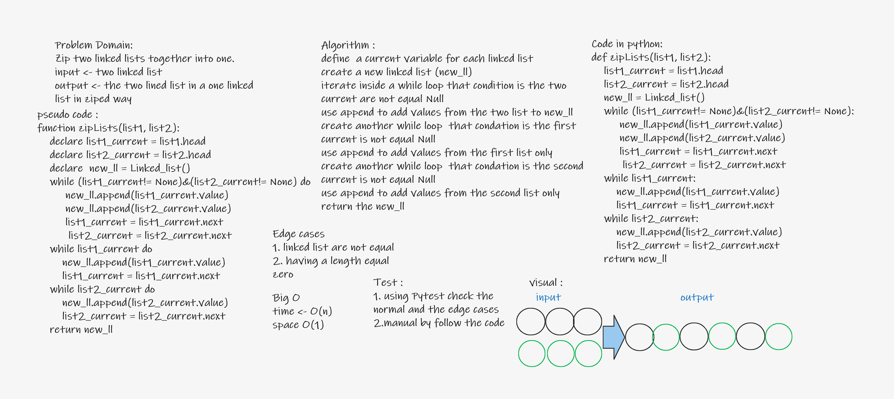

# Challenge Summary
Zip two linked lists together into one.

## Whiteboard Process

## Approach & Efficiency
* Test orianted coding due to the problem needs
* Time - O(n) Space - O(1)
## Solution
[see it](singly_linked_lists/singly_linked_list.py)