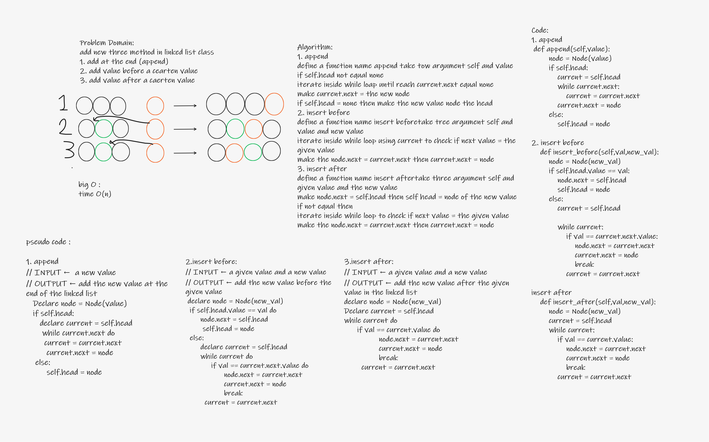

# Challenge Summary
* Add new method to the linked list class

## Whiteboard Process

## Approach & Efficiency
* Test orianted coding by checking the result of test then coding
Time - O(n) Space - O(n)
## Solution
[see it](singly_linked_lists/singly_linked_list.py)
