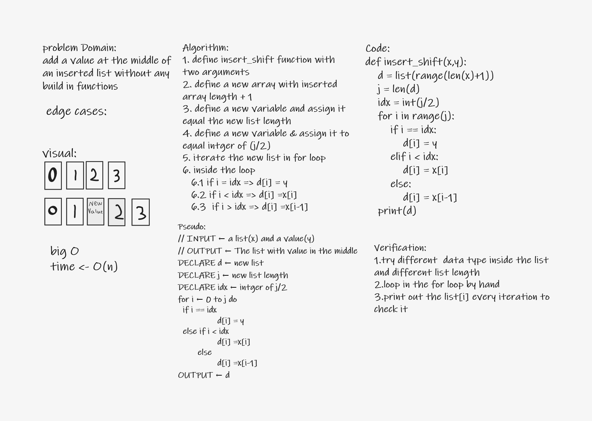

# Reverse an Array
<!-- Description of the challenge -->
* The challenge is to practice makeing a wihteborad with simple example that is insert a value in the middle of a list without biuld in function
## Whiteboard Process

## Approach & Efficiency
1.simple math 
2.one for loop to itreate inside the list.
3.swaping 