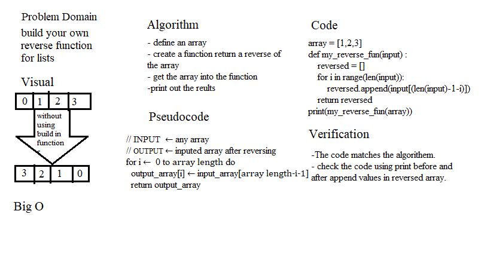

# Reverse an Array
<!-- Description of the challenge -->
* The challenge is to lear how to make a wihteborad with simple example that is reversing a list without biuld in function
## Whiteboard Process

## Approach & Efficiency
1.simple math 
2.one for loop to itreate inside the list.
3.assign values depending on (i) and (list length -1)

