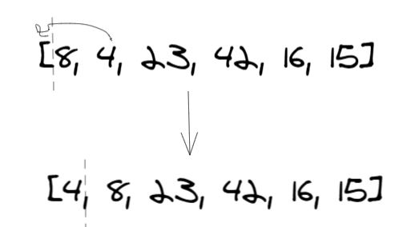
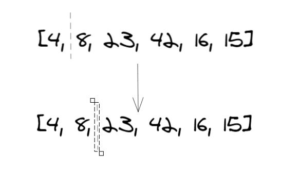
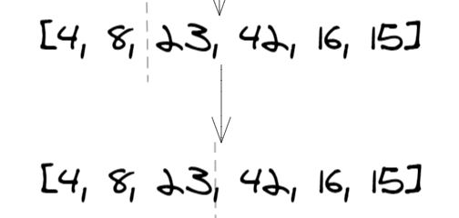
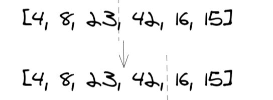
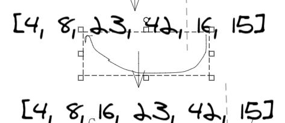
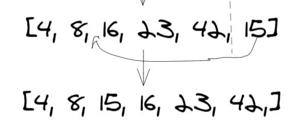

# Insertion sort 
* a simple sorting algorithm that works similar to the way you sort playing cards in your hands. The array is virtually split into a sorted and an unsorted part.Values from the unsorted part are picked and placed at the correct position in the sorted part.

## Pseudocode
```
  InsertionSort(int[] arr)

    FOR i = 1 to arr.length

      int j <-- i - 1
      int temp <-- arr[i]

      WHILE j >= 0 AND temp < arr[j]
        arr[j + 1] <-- arr[j]
        j <-- j - 1

      arr[j + 1] <-- temp
```
## Trace
#### Sample Array: [8,4,23,42,16,15]

### Pass 1



### Pass 2

### Pass 3

### Pass 4

### Pass 5

### Pass 6



## Efficency
### Time: O(n^2)
* The basic operation of this algorithm is comparison. This will happen n * (n-1) number of times
* concluding the algorithm to be n squared.
### Space: O(1)
* No additional space is being created.
* keeping the space at constant O(1).
