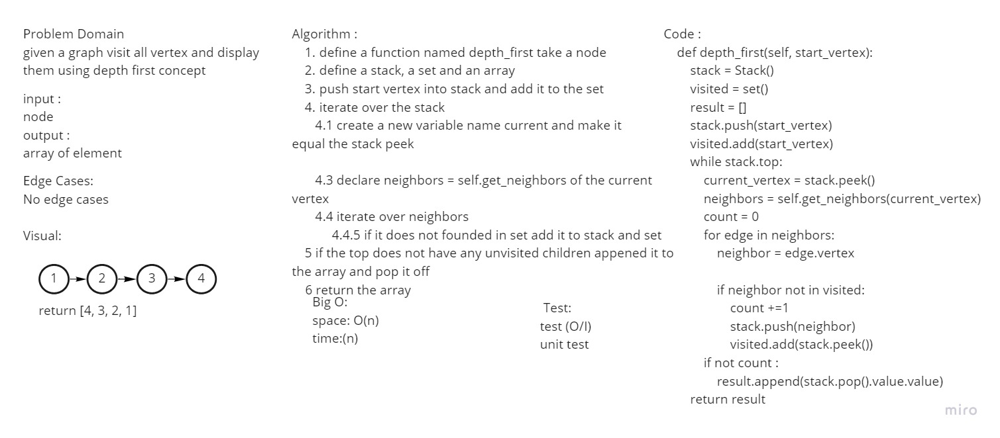

# Depth First Traversal
In a depth first traversal the approach is a bit different than the  depth first traversal of a tree. Similar to how the breadth-first uses a queue, we are going to use a Stack for our depth-first traversal.
## Challenge
Create a method traversal over the Graph using Depth First concept 

## Approach & Efficiency
* Time: O(n)
* Space: O(n)

## Solution

## Requirements
Ensure your complete solution follows the standard requirements.

1. Write [unit tests](tests/test_depth.py)
1. Follow the [template for a well-formatted README](Challenge_Documentation.md)
1. Submit the assignment following [these instructions](sum_ins.md)
