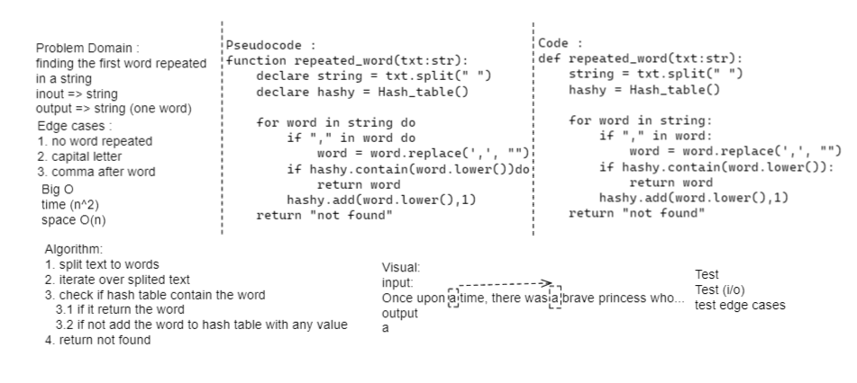

# Challenge Summary
Finding the first word to occur more than once in an any given string.

## Whiteboard Process

## Approach & Efficiency
time: O(n2)
space : O(n)
## Solution
[see it](hash_table/repeated_word.py)