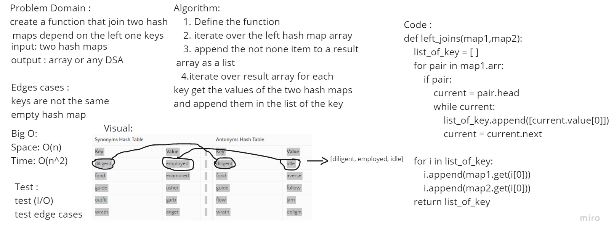

# Hashmap LEFT JOIN
the hash join is an example of a join algorithm and is used in the implementation.

## Challenge
Write a function that join two hashmaps into a single data structure using the key of left map

## Approach & Efficiency
* Time = O(n^2)
* Space = O(n)

## Solution
