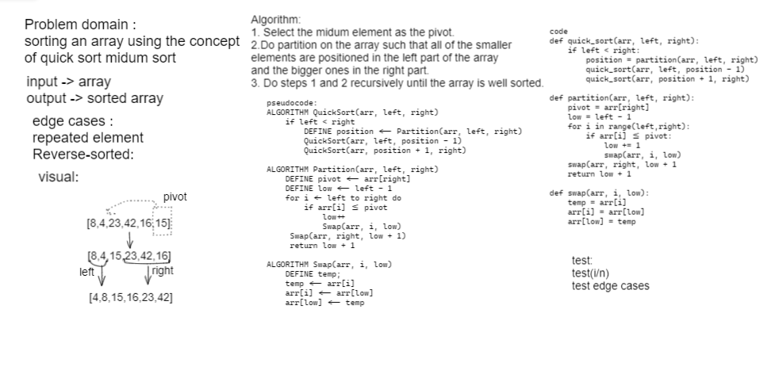

# Challenge Summary
under standing the quick sorting and write a blog about it

## Whiteboard Process

## Approach & Efficiency
- Time: O(n^2) The basic operation of this algorithm is comparison. This will happen n * (n-1) number of time
concluding the algorithm to be n squared
- Space: O(1) No additional space is being created. This array is being sorted in place…keeping the space at constant O(1).
## Solution
[see it](sorting/quicks_sort.py)