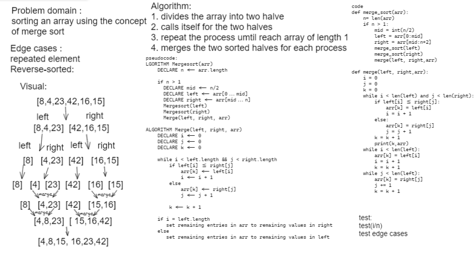

# Challenge Summary
under standing the merge sorting and write a blog about it

## Whiteboard Process

## Approach & Efficiency
- Time: O(nLogn) The basic operation of this algorithm is recurrence. 

- Space: O(n) No additional space is being created.
## Solution
[see it](sorting/marge_sort.py)