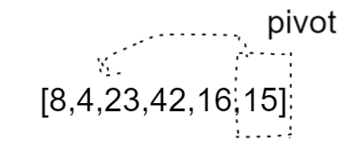
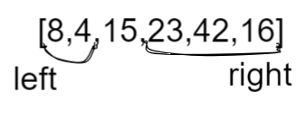
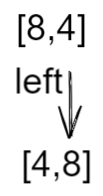
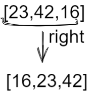

# QuickSort

QuickSort is a Divide and Conquer algorithm,it is one of the fastest sorting algorithms that exists and is the common method of choice in most sorting libraries. It picks an element as pivot and partitions the given array around the picked pivot.
## different way of picking 
1. first element as pivot.
2. last element as pivot.
3. a random element as pivot.
4. median as pivot.

## Pseudocode 
```
ALGORITHM QuickSort(arr, left, right)
    if left < right
        DEFINE position <-- Partition(arr, left, right)
        QuickSort(arr, left, position - 1)
        QuickSort(arr, position + 1, right)

ALGORITHM Partition(arr, left, right)
    DEFINE pivot <-- arr[right]
    DEFINE low <-- left - 1
    for i <- left to right do
        if arr[i] <= pivot
            low++
            Swap(arr, i, low)
     Swap(arr, right, low + 1)
     return low + 1

ALGORITHM Swap(arr, i, low)
    DEFINE temp;
    temp <-- arr[i]
    arr[i] <-- arr[low]
    arr[low] <-- temp
 
```
## Trace
#### Sample Array: [8,4,23,42,16,15]

### Pass 1:

* getting the povit value and put it in the middle 
### Pass 2:

* Divied the array into two arrays around the pivot 
* left array less than the pivot
* right array larger than the pivot
### Pass 3:

* sort the left array 

* sort the right array 
### Pass 4:
Now you have the full sorted array 

## Efficency
- Time: O(n^2) The basic operation of this algorithm is comparison. This will happen n * (n-1) number of time
concluding the algorithm to be n squared
- Space: O(1) No additional space is being created. This array is being sorted in place…keeping the space at constant O(1).