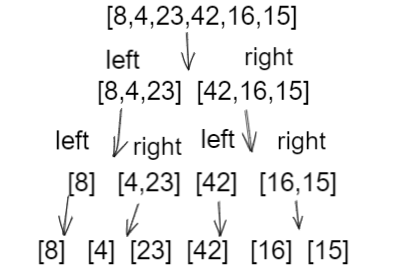
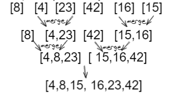

# Merge sort 
It is dividing  array into two halves then calling itself for the two halves and devid them untilreach length =1 and then merges the two sorted halves by The merge() function

## Pseudo code
```

```
## Trace
#### Sample Array: [8,4,23,42,16,15]

### Pass 1:

* Dividing the array to two halfs and divid tthe halfs to halfs until reach length of 1
### Pass 2:

* merge the halfs and sort during merging  


## Efficency
- Time: O(n^2) The basic operation of this algorithm is comparison. This will happen n * (n-1) number of time
concluding the algorithm to be n squared
- Space: O(1) No additional space is being created. This array is being sorted in place…keeping the space at constant O(1).