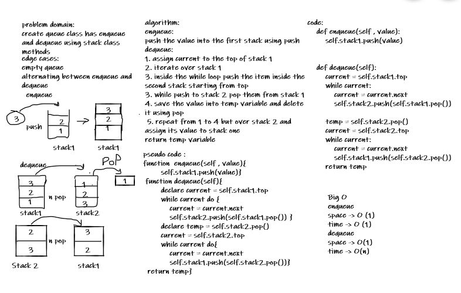

# Challenge Summary
create queue enqueue and dequeue using stacks

## Whiteboard Process

## Approach & Efficiency
enqueue :
time O(1)
space O(1)
dequeue 
space O(1)
time O(n)
## Solution
[pseudo queue](stack_and_queue/pseudo_queue.py)