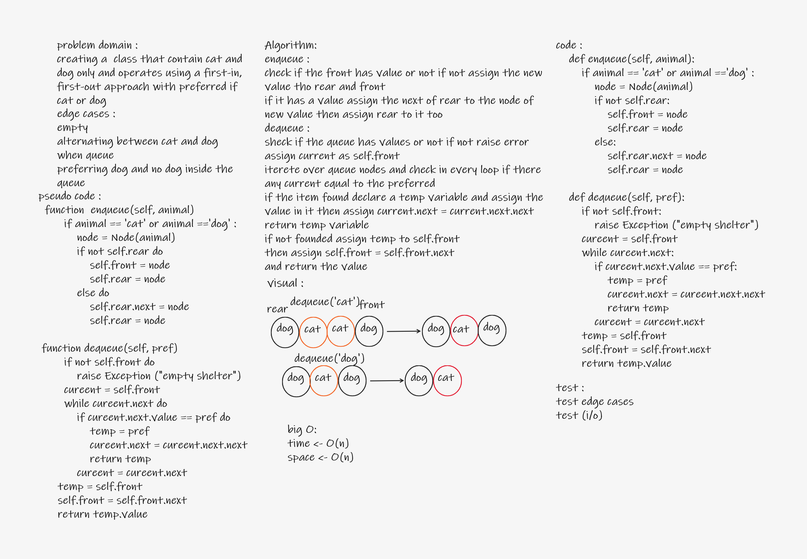

# Challenge Summary
creating a shelter class that contain car and dog only and operates using a first-in, first-out approach with prefering if cat or dog

## Whiteboard Process

## Approach & Efficiency
time O(n)
space O(n)
## Solution
[Animal shelter](stack_and_queue/animal_shelter.py)