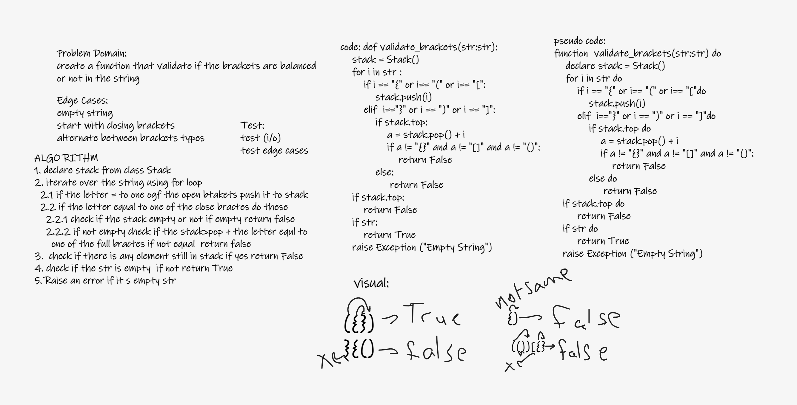

# Challenge Summary
create a function that validate if the brackets are balanced or not in the string.

## Whiteboard Process

## Approach & Efficiency
time O(n)
space O(1)
## Solution
[Validator](stack_and_queue/validating_brackets.py)