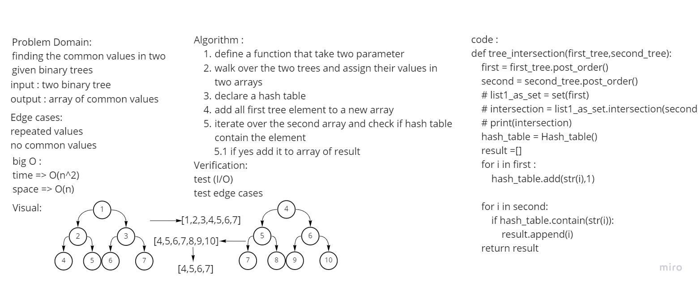

# Challenge Summary
Find common values in 2 binary trees and return them as array

## Whiteboard Process

## Approach & Efficiency
time O(n^2)
space O(n)

## Solution
[see it](tree_intersection/tree_intersection.py)