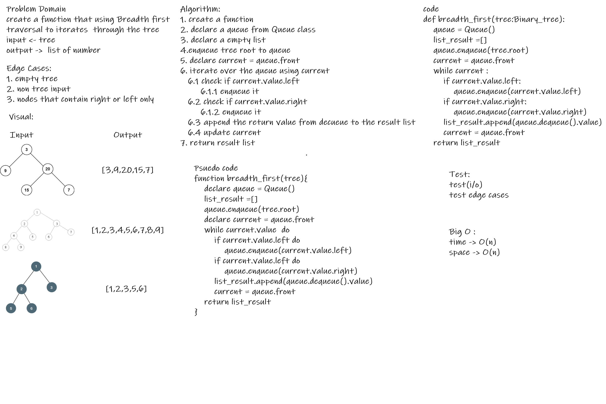

# Challenge Summary
create a function that using Breadth first traversal to iterates  through the tree
## Whiteboard Process

## Approach & Efficiency
Time O(n)
space O(n)

## Solution
[click here to see it](trees/breadth_first.py)