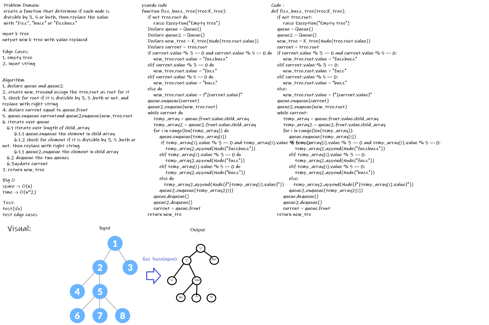

# Challenge Summary
create a function that determine if each node is divisible by 3, 5 or both, then replace the value with “Fizz”, "buzz" or "fizzbuzz"

## Whiteboard Process

## Approach & Efficiency
Big O
space -> O(n)
time -> O(n^2)
## Solution
[click here](trees/tree_fizz_buzz.py)